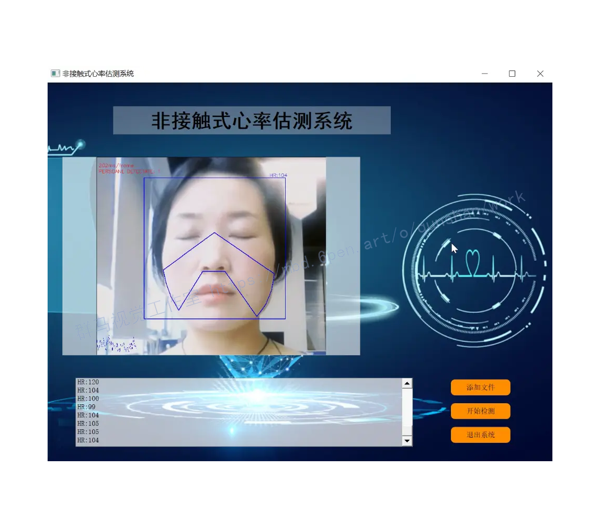
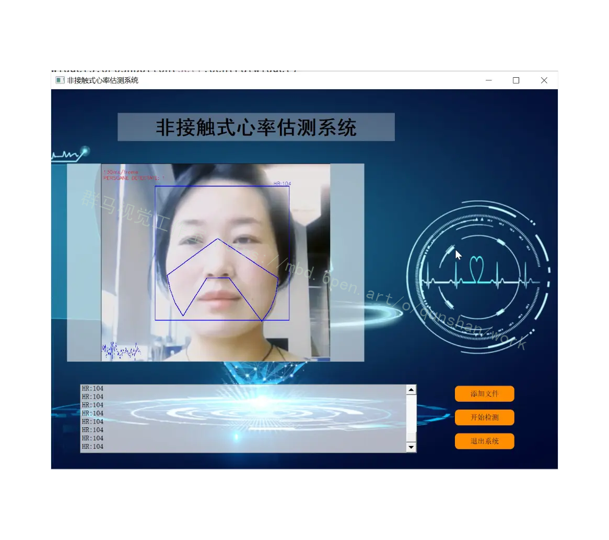
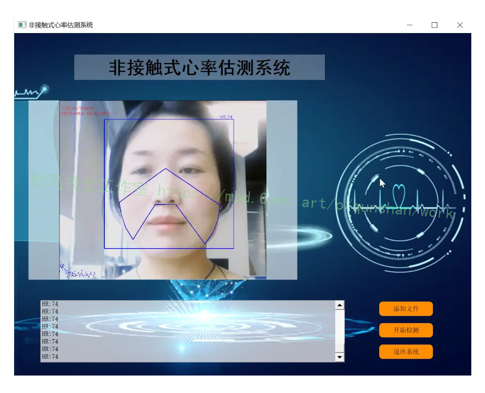
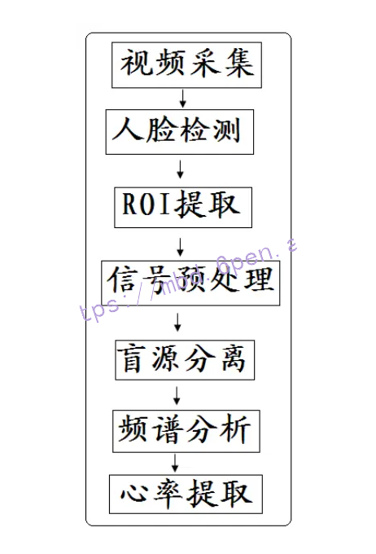
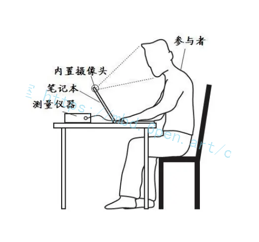
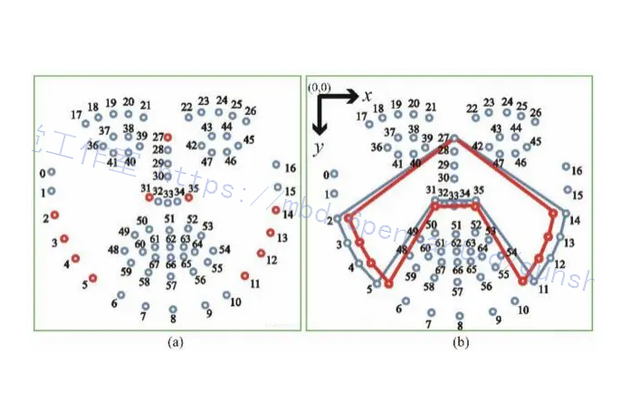
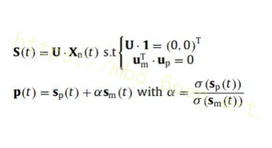
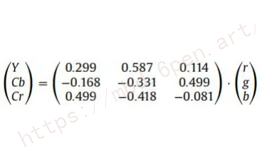
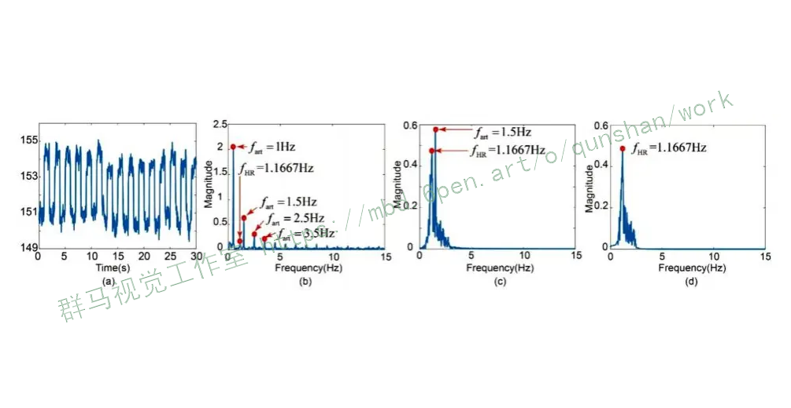



# 1.研究背景与意义


随着科技的不断发展，人们对于健康监测的需求也越来越高。心率作为一个重要的生理指标，可以反映人体的心血管功能状态，对于健康状况的评估和疾病的早期预警具有重要意义。传统的心率监测方法通常需要使用心电图仪等设备进行接触式测量，不仅不便于日常使用，而且对于某些特殊人群（如婴儿、运动员等）使用起来也存在一定的困难。

近年来，基于人脸图像的非接触式心率估测系统逐渐引起了研究者的关注。这种系统通过分析人脸图像中的微小变化，如脉搏引起的皮肤颜色变化，可以实现对心率的估测。相比传统的接触式测量方法，非接触式心率估测系统具有便携性强、操作简单、不受干扰等优点，可以在日常生活中实时监测心率，为人们提供更加便捷的健康监测手段。

然而，现有的非接触式心率估测系统还存在一些问题。其中一个主要问题是光照变化对心率估测的影响。由于光照条件的不同，人脸图像中的光谱分布会发生变化，从而导致心率估测的误差。因此，如何准确地估测心率并克服光照变化的影响成为了当前研究的一个重要课题。

基于人脸ROI（Region of Interest）光照变化光谱的非接触式心率估测系统是一种新的解决方案。ROI是指在人脸图像中选择一个特定的区域进行分析，通过对该区域的光谱变化进行建模，可以减小光照变化对心率估测的影响。这种方法可以通过选择合适的ROI区域，提取出与心率相关的特征，并通过建立光谱模型来准确估测心率。


该研究的意义主要体现在以下几个方面：

1. 提高心率估测的准确性：通过光照变化光谱的建模，可以减小光照变化对心率估测的影响，提高心率估测的准确性。这对于心率监测的精确性和可靠性具有重要意义，可以为医疗机构、运动健身行业等提供更加准确的心率监测手段。

2. 提高心率监测的便捷性：非接触式心率估测系统具有便携性强、操作简单的特点，可以在日常生活中实时监测心率。通过基于人脸ROI光照变化光谱的方法，可以进一步提高系统的便捷性，使其更加适用于各种场景，如家庭、办公室、运动场所等。

3. 探索新的应用领域：非接触式心率估测系统可以应用于多个领域，如医疗、运动健身、情感识别等。通过基于人脸ROI光照变化光谱的方法，可以进一步拓展系统的应用领域，为更多的行业提供心率监测的解决方案。

总之，基于人脸ROI光照变化光谱的非接触式心率估测系统具有重要的研究意义和应用前景。通过解决光照变化对心率估测的影响，可以提高心率估测的准确性和便捷性，为人们提供更加便捷、准确的健康监测手段。

# 2.图片演示






# 3.视频演示
[基于人脸ROI光照变化光谱的非接触式心率估测系统_哔哩哔哩_bilibili](https://www.bilibili.com/video/BV1Kz4y1N74S/?spm_id_from=333.999.0.0&vd_source=ff015de2d29cbe2a9cdbfa7064407a08)

# 4.算法流程图
本文所讨论的方法基于光电容积描述图像技术，即结合传统的 PPG技术、数字图像处理技术和数字信号处理技术来实现心率或其它生理参数的测量。与以往的PPG技术相比较，此方法只是采用普通的数字摄像头，而非光电二级管来作为信号检测器，光源也只需要普通的环境光。如此，可检测更大范围的皮肤区域，有助于提高所获取参数的信噪比，具有成本更低和使用更方便的优势。
本文所采用的基于图像和信号处理的心率检测方法的实现过程如下图所示。



# 5.核心代码讲解


#### 5.1 heartrate.py

```python

class LoggedObject:
    DEBUG = False  #

    def debug(self, *args):
        if self.DEBUG:
            print(*args)


class Settings:  # setări preluare date din fișier de configurare
    def __init__(self, config_file=None):
        try:
            with open(config_file) as f:
                self.config = json.load(f)
        except json.JSONDecodeError as e:
            print("Error loading config file:", str(e))  # eroare la încărcare
            sys.exit()
        except Exception as e:
            self.config = {}

    @property
    def ALWAYS_FACE_DETECTION(self):
        # detecția se face sau nu
        return not bool(self.config.get("do_tracking", False))

    @property
    def MAX_TRACK_SECONDS(self):
        # câte secunde se face urmărire, fără detecție
        return self.config.get("max_track_seconds", 0.3)

    @property
    def KEEP_PERSON_SECONDS(self):
        # după câte secunde o față devine istorică
        return self.config.get("keep_person_seconds", 5)

    @property
    def CASCADE_FILENAME(self):
        # calea către fișierul cascadă utilizat
        program_dir = os.path.dirname(os.path.abspath(__file__))
        default_cascade = os.path.join(program_dir, 'haarcascade_frontalface_default.xml')
        print(f"XML:{default_cascade}")
        return self.config.get("cascade_filename", default_cascade)

    @property
    def SCALE_FACTOR(self):
        # parametru detector - factor de scalare
        return self.config.get("scale_factor", 1.3)

    @property
    def MIN_NEIGHBORS(self):
        # parametru detector - nr minim vecini
        return self.config.get("min_neighbors", 4)

    @property
    def MIN_SIZE_X(self):
        # parametru detector - x minim
        return self.config.get("min_size_x", 50)

    @property
    def MIN_SIZE_Y(self):
        # parametru detector - y minim
        return self.config.get("min_size_y", 50)

    @property
    def TRACKER_TYPE(self):
        # algoritm urmărire prestabilit
        tracker_type = self.config.get("tracker_type", "MIL")
        if tracker_type not in TRACKER_TYPES:
            print("[ERROR]: Invalid tracker_type: %s" % tracker_type)
            tracker_type = "MIL"
        return tracker_type

    @property
    def DETECT_HEARTRATE(self):
        # calculează puls sau nu
        return self.config.get("detect_heartrate", True)

    @property
    def FONT(self):
        return cv2.FONT_HERSHEY_SIMPLEX


class Person(LoggedObject):
    COLOR_INDEX = 0

    MIN_HR = 70
    MAX_HR = 180

    def __init__(self, cntx, settings):
        self.display_fft = True
        self.cntx = cntx
        self.N = 250
        self.t0 = time.time()  # moment de start
        self.means = []
        self.times = []
        self.magnitude = np.array([])
        self.freqs = np.array([])
        self.color = COLORS[Person.COLOR_INDEX]
        Person.COLOR_INDEX = (Person.COLOR_INDEX + 1) % len(COLORS)
        self.tracker_type = settings.TRACKER_TYPE
        self.font = settings.FONT
        self.last_fd_frame_time = cntx.last_fd_frame_time

    def roi_mean(self):
        global ROI1
        zero = np.zeros(self.cntx.g.shape, np.uint8)
        try:
            ROIONE = ROI1[person_id]
        except:
            ROIONE = ROI1[0]
        cv2.fillConvexPoly(zero, np.array(ROIONE), 1)
        #print(zero*self.cntx.g)

        return (zero*self.cntx.g).mean()

    def update_face(self, rectangle=None):  # pe fiecare frame de fd recreez tracker si il initializez
        if rectangle is not None:
            self.last_detection_time = time.time()
            self.rectangle = rectangle  # save rect pt a sti ca este al pers resp
            self.tracker = TRACKER_TYPES[self.tracker_type].create()
            self.tracker.init(self.cntx.g, tuple(self.rectangle))
        self.add_timestamp()

    def track_face(self):
        ok, rectangle = self.tracker.update(self.cntx.g)
        if ok:  # daca tracking se face cu succes
            self.last_detection_time = time.time()  # salveaza momentul de timp
            self.rectangle = tuple(map(int, rectangle))
        self.add_timestamp()

    def add_timestamp(self):
        self.times.append(time.time() - self.t0)
        self.times = self.times[-self.N:]
        self.debug("times: %d" % len(self.times))

    def calculate_means(self):
        self.means.append(self.roi_mean())  # formez un sir din ultima parte din vector si adaug un element
        self.means = self.means[-self.N:]
        self.debug("means: %d" % len(self.means))

    def calculate_hr(self):
        self.calculate_means()
        print(f"Caculated means:{self.means}")
        if len(self.means) < 10:
            return
        y = np.array(self.means, dtype=float)
        n = len(y)  # length of the signal
        fps = float(n) / (self.times[-1] - self.times[0])
        even_times = np.linspace(self.times[0], self.times[-1], n)
        y = np.interp(even_times, self.times, y)
        y = np.hamming(n) * y  # corelatie
        y = y - np.mean(y)
        raw = np.fft.rfft(y * 2)
        fft = np.abs(raw)
        freqs = float(fps) / n * np.arange(n / 2 + 1)
        freqs = 60. * freqs
        print(f"FFT size:{len(fft)}")
        print(f"Freq size:{len(freqs)}")
        idx = np.where((freqs > Person.MIN_HR) & (freqs < Person.MAX_HR))
        self.freqs = freqs[idx]
        self.magnitude = fft[idx]

    @property
    def heart_rate(self):
        print(f"Magnitude:{self.magnitude}")
        if len(self.magnitude) < 10:
            return None
        max_idx = np.argmax(self.magnitude)
        return self.freqs[max_idx]

    def draw_widgets(self):
        x, y, w, h = self.rectangle  # dreptunghiul de față
        cv2.rectangle(self.cntx.frame, (x, y), (x + w, y + h), self.color, 2)
        print(f"Heart rate:{self.heart_rate}")
        if self.heart_rate:
            cv2.putText(self.cntx.frame, "HR:" + str(int(self.heart_rate)), (x + w - 80, y - 4), self.font, 0.8,
                        self.color, 1, cv2.LINE_AA)
        .......
```
heartrate.py是一个用于检测心率的程序文件。它使用OpenCV来进行人脸检测和跟踪，并通过计算人脸区域的颜色变化来估计心率。

程序首先导入所需的库和模块。然后定义了一些常量和全局变量。接下来是一些类的定义，包括LoggedObject、Settings、Person和Program。

Settings类用于从配置文件中获取程序的设置。它包含了一些属性，如ALWAYS_FACE_DETECTION（是否始终进行人脸检测）、MAX_TRACK_SECONDS（跟踪人脸的最大时间）、KEEP_PERSON_SECONDS（人脸保留的时间）、CASCADE_FILENAME（人脸检测所使用的级联分类器文件路径）等。

Person类表示一个人物，它包含了一些属性和方法，如update_face（更新人脸区域）、track_face（跟踪人脸）、calculate_hr（计算心率）等。

Program类是程序的主类，它包含了一些属性和方法，如face_detector（人脸检测器）、skin_detector（皮肤检测器）、cap（视频捕获对象）、persons（人物列表）等。它还包含了一些辅助方法，如is_my_face（判断人脸是否属于某个人物）和draw_widgets（绘制人脸区域和心率信息）等。

程序的主要逻辑在Program类的__init__方法中。它首先创建了一个视频捕获对象，然后进入一个循环，不断读取视频帧并进行处理。在每一帧中，程序首先进行人脸检测，然后根据检测结果进行人脸跟踪或重新初始化跟踪器。接下来，程序计算人脸区域的颜色变化，并根据颜色变化来估计心率。最后，程序绘制人脸区域和心率信息，并显示在屏幕上。


#### 5.2 ui.py

```python

COLORS = [(255, 0, 0), (0, 255, 0), (0, 0, 255), (255, 128, 0), (128, 255, 0), (0, 128, 255)]
TRACKER_TYPES = {
    'BOOSTING': cv2.TrackerBoosting,
    'MIL': cv2.TrackerMIL,
    'KCF': cv2.TrackerKCF,
    'TLD': cv2.TrackerTLD,
    'MEDIANFLOW': cv2.TrackerMedianFlow,
    'GOTURN': cv2.TrackerGOTURN,
    'MOSSE': cv2.TrackerMOSSE,
}

class LoggedObject:
    DEBUG = False

    def debug(self, *args):
        if self.DEBUG:
            print(*args)

class Settings:
    def __init__(self, config_file=None):
        try:
            with open(config_file) as f:
                self.config = json.load(f)
        except json.JSONDecodeError as e:
            print("Error loading config file:", str(e))
            sys.exit()
        except Exception as e:
            self.config = {}

    @property
    def ALWAYS_FACE_DETECTION(self):
        return not bool(self.config.get("do_tracking", False))

    @property
    def MAX_TRACK_SECONDS(self):
        return self.config.get("max_track_seconds", 0.3)

    @property
    def KEEP_PERSON_SECONDS(self):
        return self.config.get("keep_person_seconds", 5)

    ......

class Person(LoggedObject):
    COLOR_INDEX = 0
    MIN_HR = 70
    MAX_HR = 180

    def __init__(self, cntx, settings):
        self.display_fft = True
        self.cntx = cntx
        self.N = 250
        self.t0 = time.time()
        self.means = []
        self.times = []
        self.magnitude = np.array([])
        self.freqs = np.array([])
        self.color = COLORS[Person.COLOR_INDEX]
        Person.COLOR_INDEX = (Person.COLOR_INDEX + 1) % len(COLORS)
        self.tracker_type = settings.TRACKER_TYPE
        self.font = settings.FONT
        self.last_fd_frame_time = cntx.last_fd_frame_time

    def roi_mean(self):
        global ROI1
        zero = np.zeros(self.cntx.g.shape, np.uint8)
        try:
            ROIONE = ROI1[person_id]
        except:
            ROIONE = ROI1[0]
        cv2.fillConvexPoly(zero, np.array(ROIONE), 1)
        return (zero*self.cntx.g).mean()

    def update_face(self, rectangle=None):
        if rectangle is not None:
            self.last_detection_time = time.time()
            self.rectangle = rectangle
            self.tracker = TRACKER_TYPES[self.tracker_type].create()
            self.tracker.init(self.cntx.g, tuple(self.rectangle))
        self.add_timestamp()

    def track_face(self):
        ok, rectangle = self.tracker.update(self.cntx.g)
        if ok:
            self.last_detection_time = time.time()
            self.rectangle = tuple(map(int, rectangle))
        self.add_timestamp()

    def add_timestamp(self):
        self.times.append(time.time() - self.t0)
        self.times = self.times[-self.N:]
        self.debug("times: %d" % len(self.times))

    def calculate_means(self):
        self.means.append(self.roi_mean())
        self.means = self.means[-self.N:]
        self.debug("means: %d" % len(self.means))

    def calculate_hr(self):
        ......
```
  


该程序文件是一个使用PyQt5和OpenCV库实现的人脸识别和心率检测的应用程序。程序首先从配置文件中读取设置信息，然后通过摄像头或视频文件获取图像帧。程序使用OpenCV的人脸检测器检测图像帧中的人脸，并使用dlib库的形状预测器获取人脸的关键点。然后，程序使用OpenCV的跟踪器对人脸进行跟踪，并计算人脸区域的平均亮度值。最后，程序使用FFT算法计算心率，并将心率值显示在人脸区域上。

程序中的一些重要类和函数包括：
- `LoggedObject`：一个基类，用于在调试模式下打印调试信息。
- `Settings`：从配置文件中读取设置信息的类。
- `Person`：表示检测到的人脸的类，包含人脸的跟踪器、关键点和心率计算等属性和方法。
- `Program`：主程序类，负责处理图像帧、人脸检测和跟踪、心率计算等逻辑。

程序的运行逻辑如下：
1. 读取配置文件中的设置信息。
2. 打开摄像头或视频文件。
3. 循环读取图像帧：
   - 检测人脸并获取关键点。
   - 根据设置信息决定是否进行人脸跟踪。
   - 计算人脸区域的平均亮度值。
   - 如果需要计算心率，则使用FFT算法计算心率。
   - 在图像帧上绘制人脸区域和心率值。
   - 显示图像帧。
4. 关闭摄像头或视频文件。


# 6.系统整体结构

整体功能和构架概述：
该项目是一个基于人脸ROI光照变化光谱的非接触式心率估测系统。它使用计算机视觉技术来检测人脸，并通过分析人脸区域的颜色变化来估计心率。系统包含三个主要文件：heartrate - 副本.py、heartrate.py和ui.py。

heartrate.py是一个用于检测心率的程序文件，使用OpenCV。它定义了一些常量和全局变量，并包含了一些类的定义，如LoggedObject、Settings、Person和Program。程序的主要逻辑在Program类的__init__方法中，通过循环读取视频帧并进行人脸检测、跟踪和心率计算。

ui.py是一个使用PyQt5和OpenCV库实现的人脸识别和心率检测的应用程序。它从配置文件中读取设置信息，并通过摄像头或视频文件获取图像帧。程序使用OpenCV的人脸检测器检测人脸，并使用dlib库的形状预测器获取人脸的关键点。然后，程序使用OpenCV的跟踪器对人脸进行跟踪，并计算人脸区域的平均亮度值。最后，程序使用FFT算法计算心率，并将心率值显示在人脸区域上。

下表整理了每个文件的功能：

| 文件名 | 功能 |
| ------ | ------ |
| heartrate.py | 实现心率检测的程序文件，使用OpenCV|
| ui.py | 实现人脸识别和心率检测的应用程序，使用PyQt5和OpenCV库 |

# 7.图像采集
本文所采用的视频的拍摄在室内进行，由透过窗户照射的阳光来照明。参与者坐在一台有内置摄像头的笔记本电脑前40到50厘米左右的位置,静静而坐，自然地呼吸，面对着摄像头拍摄60秒的彩色视频。在拍摄视频的同时再利用物理测量仪器测量参与者的脉搏。拍摄示意图如图4-1所示。


所有拍摄的视频皆以24位RGB真彩色、15帧/秒的帧速、640×480的像素分辨率采集，在电脑中皆以AVI格式保存下来。如果相机、手机或电脑摄像头拍摄到的视频文件的默认保存格式不是AVI格式，如常见的有安卓手机的mp4格式、iphone手机的mov格式等，为了处理方便，本文都将在电脑中通过专门的视频格式转换软件(如格式工厂)将它们都转换为标准的AVI格式。AVI格式体积虽然相对于mp4、mov格式要小得多，但它却不会损失多少光电信息，而且其调用方便、图像质量足够好。

# 8.面部ROI检测和跟踪
一般来说，有各种非刚性的运动(如说话、微笑、冥想和其他情绪表达）或刚性的运动（如头部的平移和旋转〉。
这些动作可能会导致录制的视频中的颜色变化。因此，可以认为正确检测和跟踪人的面部皮肤部位，同时消除非刚性运动的部位，是一个合理的计划。另一方面，暴露的面部皮肤中的前额和脸颊区域包含更多的BVP信息[2]。然而，前额的区域可以被毛发覆盖。因此，双颊区域被选择作为面部ROI。
首先，利用改进的线性支持向量机（LSVM)检测器和定向梯度的直方图(HOG）对检测器进行[3]检测，然后得到68个面部地标的坐标1通过应用68个面部地标预测模型，估计受试者不同姿势的特征。其中，No.选择2、3、4、5、31、35、11、12、13、14、27个地标(图).为了避免这种情况下，一些估计地标之间的边界皮肤和非皮肤区域被认为是在实际的非皮肤区域当主题移动他或她的头，一个新的轮廓通过稍微修改x或y坐标的地标除了N&27选择区域内的轮廓作为面部投资回报率。


# 9.基于改进的SB-CWT方法提取BVP信号从而估算心率
谷歌大脑提出的子波段方法对光源和运动的一些假设(通过将对单光源和单运动的假设扩展到对多光源和多运动的假设）来提高降噪能力。换句话说，利用时频变换技术将RGB通道的时间信号转换为频域信号。g.傅里叶变换或小波变换)，然后对每个子带/尺度采用带有加权过程的POS方法，得到最终的BVP信号。因此，子频带方法也可以看作是基于POS方法的。POS方法包括时间归一化、投影和微调步骤。

其中=(up, um)TeR2×3为投影矩阵，S (t)= (sp (t)、sm (t)>TER2×N表示Xn (t)在POSplane上的投影，1=(1、1、1) T, p (t)是指通过α调谐是标准偏差运算符。在投影后，在sp (t)中，脉冲信号变得尽可能最大，运动伪影变得尽可能最小，而在sm (t)中，反之亦然。通过α微调，得到了无噪声伪影的BVP信号。事实上，考虑到投影步骤是RGB通道信号的线性组合，RGB通道中包含的脉冲信息是不同的彼此[12,31]，毫无疑问，投影矩阵的设置将对人力资源的估计有一定的影响。
在POS方法和子带方法中，时间归一化的RGB信号被投影到两个投影轴上(向上=(0,1，-1) T, um =(-2,1,1) T)在POS平面上相互正交，投影轴向上= (0,1，-1)T被确定为粗糙的BVP方向。也就是说，在pos平面上，up-方向分量(G信道信号与B信道信号的差sp (t)=up.Xn (t)=gn (t)-bn(t))成为一个粗略的BVP信号。我们的主要目的是找到一个新的投影矩阵，它不仅要满足等式的第一个约束条件(3)，但也近似满足等式的第二个约束条件。

对角线平均再次应用于频谱集的初等矩阵FBVP以获得去除光照变化干扰的时间BVP信号。用FFT将BVP信号转换为频域信号，然后得到最高峰值f人力资源在频域中可以找到。心率以HR=f计算人力资源*60．图显示了在人工方波形照明变化条件下记录的一个代表性面部视频的g通道跟踪信号，以及基于SB-CWT (CbCr)和SSA组合抑制照明诱导伪影的结果。由心电传感器得到的地面真实HR对应的频率为f小时=1.1667 Hz.如图所示。6(b)，光照变化的强干扰包含在原始的面部ROI光通道跟踪信号中。结果将SB-CWT (CbCr)应用于原始的面部ROIRGB跟踪信号，提取BVP信号，一些频谱成分包括主频率放屁=1Hz的干扰照明变化被抑制。然而，在放屁=为1.5Hz时，照度变化的干扰幅度仍然高于实际的BVP信号。在使用SSA来减少噪声伪影后，残差与BVP信号相比，BVP信号有所降低。这个结果与每分钟70次的基本事实相一致。



# 10.基于SSA的噪声伪影的提取与消除

PPGI信号的形成过程的相机可以描述基于二色反射模型[2]，这是光反射模型从一个不均匀的材料，和复杂的血流机制在毛细血管由于泵的心脏[3,4]。根据AAAI提出的皮肤组织的二色反射模型，脉冲信号可以用皮肤真皮层中血红蛋白的光吸收所引起的漫射反射来描述。另一方面，由主体的刚性和非刚性运动或摄像机运动引起的伪影信号，可以用皮肤角质层的镜面反射来表示。最后，摄像机记录的PPGI信号由目标反射（漫反射和镜面反射的和)与入射辐照度的乘积形成。通过这样的PPGI信号形成过程，我们可以看到以下几点:首先，PPGI信号形成过程可以看作是一个严格意义上的非平稳非线性过程。e.，PPGI信号不仅包含运动伪影、照明变化的干扰和脉冲信号，还包含交流调制分量。在运动伪影中，光照变化和BVP信号的干扰，振幅(i。e.,BVP信号的能量)最小，根据运动伪影和光照变化的水平，交流调制分量可以比BVP信号具有更大的能量。其次，面部PPGI信号包括所有的噪声伪影（如照明变化的干扰、运动伪影）和BVP信号。此外，还可以认为噪声伪影对单个RGB通道的影响几乎相同，而脉冲信号根据光的波长而不同(i。e.，RGB通道）。换句话说，G信道包含脉冲信号的信息，其次是R信道和B信道[1]。
同时，现有的基于模型的人力资源测量方法和基于基本标准的方法有一些不同的实现，但他们有一个内在的共同特征，即建模或假设PPGI信号收集的相机可以运动伪影的线性组合，照明变化的干扰，和脉冲信号。考虑到上述事实，该建模或假设可以在良好控制的条件下成功地保持(e。g.，比如被试坐在相机前或轻微移动，照明几乎没有变化的情况)。然而，这种线性组合模型并没有在复杂的条件下保持，如受试者进行健身锻炼或光照变化显著，这可能导致基于PPGI的HR测量的性能显著下降。克服这一缺点的一种方法是合理地采用一种强大的方法来处理非平稳和非线性信号。


SSA是一种非参数谱估计方法，它基于时间序列轨迹矩阵的奇异值分解（SVD)将时间序列分解为有意义的分量，而不需要任何关于时间序列[27]的先验知识。由于SSA是一种基于支持向量值的子空间分解方法，虽然不相关分量的频率几乎相同，但它们可以很容易地分离，如果它们的能量(i。e.，特征值)是不同的[6]。考虑到上述两个事实以及SSA作为一种非参数/子空间分解方法的优点，将光照变化等伪影的光谱直接从面部ROI的PPGI信号中提取，而不是从背景中提取。为此，我们假设人脸ROI包含了关于光照变化的干扰、运动伪影和脉冲信号的所有信息，并且脉冲信号的能量最小。此外，还假设噪声伪影（照明变化或运动伪影除了球形伪影）独立于脉冲信号。基于这些假设和噪声伪影几乎相同的影响所有RGB通道，但脉冲波信号的信息是最小的B通道，噪声伪影的重要光谱提取应用SSAB通道跟踪信号从面部ROI。如果光照发生显著变化，虽然使用改进的SB-CWT (CbCr）提取BVP信号，但它可以包含与真实BVP信号能量等效或更大的噪声伪影，最终导致HR测量失败。为了消除提取的BVP信号中的残余噪声伪影，再次对提取的BVP信号应用SSA来估计光谱。然后将两个光谱（一个从人脸双沟道跟踪信号中获得，另一个从使用SB-CWT (CbCr）方法提取的BVP信号中获得）进行比较，得到无噪声伪影的BVP信号。

# 11.系统整合

下图[完整源码＆环境部署视频教程＆自定义UI界面](https://s.xiaocichang.com/s/beff19)


参考博客[《基于人脸ROI光照变化光谱的非接触式心率估测系统》](https://zhuanlan.zhihu.com/p/663950749)

# 12.参考文献
---
[1][王智文](https://s.wanfangdata.com.cn/paper?q=%E4%BD%9C%E8%80%85:%22%E7%8E%8B%E6%99%BA%E6%96%87%22),[蔡启先](https://s.wanfangdata.com.cn/paper?q=%E4%BD%9C%E8%80%85:%22%E8%94%A1%E5%90%AF%E5%85%88%22),[陈劲飙](https://s.wanfangdata.com.cn/paper?q=%E4%BD%9C%E8%80%85:%22%E9%99%88%E5%8A%B2%E9%A3%99%22),等.[利用肤色分割和自适应模版匹配的人脸检测](https://d.wanfangdata.com.cn/periodical/gxgxyxb201301001)[J].[广西工学院学报](https://sns.wanfangdata.com.cn/perio/gxgxyxb).2013,(1).DOI:10.3969/j.issn.1004-6410.2013.01.001 .

[2][刘赫](https://s.wanfangdata.com.cn/paper?q=%E4%BD%9C%E8%80%85:%22%E5%88%98%E8%B5%AB%22),[王亚东](https://s.wanfangdata.com.cn/paper?q=%E4%BD%9C%E8%80%85:%22%E7%8E%8B%E4%BA%9A%E4%B8%9C%22),[王磊](https://s.wanfangdata.com.cn/paper?q=%E4%BD%9C%E8%80%85:%22%E7%8E%8B%E7%A3%8A%22).[基于光体积描述记成像技术的非接触低成本生理信息的检测](https://d.wanfangdata.com.cn/periodical/jcjx201202006)[J].[集成技术](https://sns.wanfangdata.com.cn/perio/jcjx).2012,(2).

[3][马俊领](https://s.wanfangdata.com.cn/paper?q=%E4%BD%9C%E8%80%85:%22%E9%A9%AC%E4%BF%8A%E9%A2%86%22),[王成](https://s.wanfangdata.com.cn/paper?q=%E4%BD%9C%E8%80%85:%22%E7%8E%8B%E6%88%90%22),[李章俊](https://s.wanfangdata.com.cn/paper?q=%E4%BD%9C%E8%80%85:%22%E6%9D%8E%E7%AB%A0%E4%BF%8A%22),等.[基于PPG的心率和呼吸频率的测量研究](https://d.wanfangdata.com.cn/periodical/gxjs201103011)[J].[光学技术](https://sns.wanfangdata.com.cn/perio/gxjs).2011,(3).

[4][孙丽霞](https://s.wanfangdata.com.cn/paper?q=%E4%BD%9C%E8%80%85:%22%E5%AD%99%E4%B8%BD%E9%9C%9E%22),[王颖](https://s.wanfangdata.com.cn/paper?q=%E4%BD%9C%E8%80%85:%22%E7%8E%8B%E9%A2%96%22).[VC++基于WebCam的人脸识别技术](https://d.wanfangdata.com.cn/periodical/hljkjxx201104065)[J].[黑龙江科技信息](https://sns.wanfangdata.com.cn/perio/hljkjxx).2011,(4).DOI:10.3969/j.issn.1673-1328.2011.04.065 .

[5][何伟城](https://s.wanfangdata.com.cn/paper?q=%E4%BD%9C%E8%80%85:%22%E4%BD%95%E4%BC%9F%E5%9F%8E%22),[陈进军](https://s.wanfangdata.com.cn/paper?q=%E4%BD%9C%E8%80%85:%22%E9%99%88%E8%BF%9B%E5%86%9B%22).[基于红外方式的嵌入式人体心率检测系统设计](https://d.wanfangdata.com.cn/periodical/xdjsj-xby201104030)[J].[现代计算机(专业版)](https://sns.wanfangdata.com.cn/perio/xdjsj-xby).2011,(4).DOI:10.3969/j.issn.1007-1423-B.2011.04.030 .

[6][高新军](https://s.wanfangdata.com.cn/paper?q=%E4%BD%9C%E8%80%85:%22%E9%AB%98%E6%96%B0%E5%86%9B%22),[刘新颖](https://s.wanfangdata.com.cn/paper?q=%E4%BD%9C%E8%80%85:%22%E5%88%98%E6%96%B0%E9%A2%96%22).[脉搏血氧饱和度测量原理及常见血氧探头](https://d.wanfangdata.com.cn/periodical/ylsbxx201006020)[J].[中国医疗设备](https://sns.wanfangdata.com.cn/perio/ylsbxx).2010,(6).DOI:10.3969/j.issn.1674-1633.2010.06.020 .

[7][刘喜荣](https://s.wanfangdata.com.cn/paper?q=%E4%BD%9C%E8%80%85:%22%E5%88%98%E5%96%9C%E8%8D%A3%22),[田启川](https://s.wanfangdata.com.cn/paper?q=%E4%BD%9C%E8%80%85:%22%E7%94%B0%E5%90%AF%E5%B7%9D%22).[基于肤色模型和模板匹配的人脸检测方法研究](https://d.wanfangdata.com.cn/periodical/tyzxjjxyxb201005006)[J].[太原科技大学学报](https://sns.wanfangdata.com.cn/perio/tyzxjjxyxb).2010,(5).DOI:10.3969/j.issn.1673-2057.2010.05.006 .

[8][田甜](https://s.wanfangdata.com.cn/paper?q=%E4%BD%9C%E8%80%85:%22%E7%94%B0%E7%94%9C%22),[乐嘉锦](https://s.wanfangdata.com.cn/paper?q=%E4%BD%9C%E8%80%85:%22%E4%B9%90%E5%98%89%E9%94%A6%22).[基于肤色及AdaBoost算法的改进的人脸检测方法](https://d.wanfangdata.com.cn/periodical/jsjyyyrj200912027)[J].[计算机应用与软件](https://sns.wanfangdata.com.cn/perio/jsjyyyrj).2009,(12).DOI:10.3969/j.issn.1000-386X.2009.12.027 .

[9][马桂英](https://s.wanfangdata.com.cn/paper?q=%E4%BD%9C%E8%80%85:%22%E9%A9%AC%E6%A1%82%E8%8B%B1%22).[基于肤色特征的人脸区域检测](https://d.wanfangdata.com.cn/periodical/yhqyykj200911011)[J].[沿海企业与科技](https://sns.wanfangdata.com.cn/perio/yhqyykj).2009,(11).DOI:10.3969/j.issn.1007-7723.2009.11.011 .

[10][曲培树](https://s.wanfangdata.com.cn/paper?q=%E4%BD%9C%E8%80%85:%22%E6%9B%B2%E5%9F%B9%E6%A0%91%22),[董文会](https://s.wanfangdata.com.cn/paper?q=%E4%BD%9C%E8%80%85:%22%E8%91%A3%E6%96%87%E4%BC%9A%22),[陈志国](https://s.wanfangdata.com.cn/paper?q=%E4%BD%9C%E8%80%85:%22%E9%99%88%E5%BF%97%E5%9B%BD%22).[一种利用R/G值检测人脸的方法](https://d.wanfangdata.com.cn/periodical/dzxyxb200704009)[J].[德州学院学报](https://sns.wanfangdata.com.cn/perio/dzxyxb).2007,(4).DOI:10.3969/j.issn.1004-9444.2007.04.009 .


# 若您发现上述博客中的代码，以及"系统整合"小节中的链接引用的代码，仍无法满足您的需求，请先在GitHub上为该项目点赞（Star）。随后，请编辑一封邮件，附上点赞的截图、项目的中文描述概述（About）以及您需要该项目源码的用途，发送到我们的邮箱sharecode@yeah.net。我们审核后会根据邮件的接收顺序，定期将源码和环境部署教程发送到您的邮箱。
